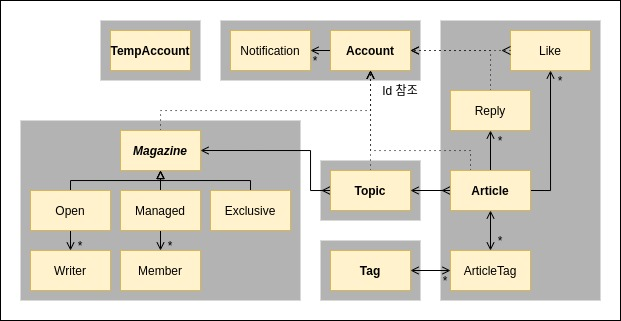

# Paper 

웹 / 개발 1인 + 비개발 1인 / 2020. 9 - 12 / [웹사이트](https://onpaper.cf)  
자바, 스프링, JPA / 타임리프, 자바스크립트 / 도커, nginx, ec2 & rds(postgres), https

매거진(공유 블로그) 서비스입니다.   
매거진은 쓰기권한 설정에 따라 공개카페, 멤버십카페/팀블로그, 개인블로그에 해당합니다.   
메일 인증, 댓글, 태그, 좋아요, 알림 등의 기능을 제공합니다.

---

## 도메인

### 매거진

- 매거진은 쓰기권한 설정에 따라 공개카페, 멤버십카페, 개인 블로그처럼 사용할 수 있습니다.
- 상속을 통해 구현하였으며, 팀 블로그에는 멤버로 지원할 수 있습니다.
- 매거진의 점수는 아티클 점수의 총합이며 순위에 따라 정렬됩니다.

### 토픽

- 토픽은 매거진-토픽-아티클의 계층을 구성하는 카테고리입니다.
- 이 계층들은 다대일 단방향 관계로 매핑하고, AJAX를 통해 조회하도록 하였습니다.

### 아티클

- 아티클은 공개/비공개를 전환할 수 있고, 댓글 및 라이크와 태그를 갖습니다.
- 댓글과 라이크는 아티클 애그리거트에 속하므로 리포지토리 없이 영속성 전이로 관리하였습니다.
- 태그는 아티클과 개념적으로 다대다 관계에 있으나, 연결 객체를 활용해 구현하였습니다.

### 알림

- 매거진 멤버 신청 또는 아티클 라이크 등의 경우 알림이 발생합니다.
- 회원 애그리거트에 속하며, 이벤트를 통해 생성됩니다.

---

## 데이터

JPA를 사용하였고, OSIV를 비활성화하였으며, DTO를 이용하였습니다.

### 쿼리 튜닝

- 기본적으로 지연로딩을 사용하고, 필요한 경우 페치 조인을 사용하였습니다.
- 다대일 N+1 문제는 JPQL 페치 조인을 사용하였습니다.
- 일대다 N+1 문제는 in절(@BatchSize)을 사용하였습니다.

### 캐시용 빈

- 자주 사용되는 데이터는 스프링 빈을 캐시/버퍼로 활용하여 메모리에 올려두었습니다.
- API로 제공되는 베스트 매거진 목록은 캐시에 위치하며 @Scheduled 등을 통해 갱신됩니다.
- 메인 화면의 아티클 발췌는 버퍼 위에서 수동 갱신되며 생성/소멸시 데이터베이스와 동기화됩니다.

---

## 웹

타임리프를 사용하였고, 부분적으로 API를 제공했습니다.

### 보안

- 스프링 시큐리티를 사용하여 세션 방식으로 사용자를 인증하였습니다.
- 패스워드 인코딩, HTTPS를 적용했고, 인젝션과 포트 개방 등에도 주의를 기울였습니다.

### 예외

- @ControllerAdvice 클래스의 @ExceptionHandler 메서드로 예외를 한 곳에서 처리하였습니다.
- 에러 페이지를 내보내는 방식이라서 200 OK 응답이 나간다는 점이 다소 애매합니다.

---

## 테스트

Junit 테스트를 작성하였습니다.

### 깨지기 쉬운 테스트 문제

- 프로젝트 초반 컨트롤러 통합 테스트로 TDD를 하였으나, 깨지기 쉬운 테스트 문제를 경헙하였습니다.
- 기존 테스트를 제거하고 POJO 테스트 등을 보강하기는 했으나, 여전히 이 프로젝트의 테스트는 미흡합니다.
- 이 경험을 통해 다음 프로젝트에서는 테스트 전략을 구상하고 진행하여 수월한 TDD가 가능했습니다.

---

## 배포

AWS EC2에 배포하였습니다.

### 프로퍼티

- 프로파일을 통해 개발환경과 운영환경을 분리하였습니다.
- 패스워드를 포함하는 프로퍼티 파일은 파일 시스템에서 참조하도록 하였습니다.
- 로그 역시 파일 시스템에 저장되도록 설정하였고, 디버깅에 활용하였습니다.

### 도커와 블루그린

- 트래비스CI - 도커허브 - 웹훅 - 업데이터 - 셸스크립트로 배포를 자동화하였습니다.
- NGINX를 활용하여 블루-그린 방식의 무중단 배포가 이루어지도록 하였습니다.
- 도커가 의미있게 사용되지 못한 점과 셸 러너에 불과한 업데이터가 무거운 스프링이라는 점이 아쉽습니다.
